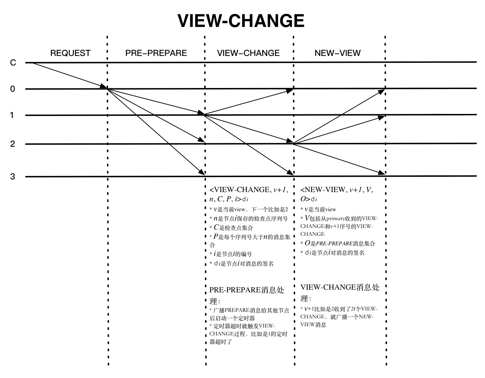



# 共识算法（consensus）#

peer节点启动的时候根据配置文件core.yaml文件配置项peer.validator.consensus.plugin选择采用哪种共识算法。目前Fabric实现了两种共识算法NOOPS和PBFT，默认是NOOPS：

  * NOOPS：是一个供开发和测试使用的插件，会处理所有收到的消息。
  * PBFT：PBFT算法实现。

## 0x01 插件接口 ##

  * Consenter

```
// ExecutionConsumer allows callbacks from asycnhronous execution and statetransfer
type ExecutionConsumer interface {
	Executed(tag interface{})                                // Called whenever Execute completes
	Committed(tag interface{}, target *pb.BlockchainInfo)    // Called whenever Commit completes
	RolledBack(tag interface{})                              // Called whenever a Rollback completes
	StateUpdated(tag interface{}, target *pb.BlockchainInfo) // Called when state transfer completes, if target is nil, this indicates a failure and a new target should be supplied
}

// Consenter is used to receive messages from the network
// Every consensus plugin needs to implement this interface
type Consenter interface {
	RecvMsg(msg *pb.Message, senderHandle *pb.PeerID) error // Called serially with incoming messages from gRPC
	ExecutionConsumer
}
```

每个共识插件都需要实现Consenter接口，包括RecvMsg函数和ExecutionConsumer接口里的函数（可以直接返回）。

Consenter是EngineImpl的一个成员，EngineImpl是接口Engine的一个实例，是在peer启动的时候创建的，连同Impl的其他成员一起注册到gRPC服务中。当通过gRPC收到ProcessTransaction消息时，最终会调用Consenter的RecvMsg处理交易信息。

ExecutionConsumer接口是专门处理事件消息的，它是Stack的成员Executor的一个接口。coordinatorImpl是Executor的一个实例，在实例化coordinatorImpl的时候同时设置自身为成员变量Manager的事件消息接收者，然后启动一个协程循环处理接收到的事件，根据不同的事件类型，调用ExecutionConsumer的不同函数。特别说明一下，事件在内部是channel实现的生产者/消费者模型，只有一个缓冲区，如果处理不及时会出现消息等待的情况，在实际产品化过程中需要进行优化。

  * Stack

```
// Stack is the set of stack-facing methods available to the consensus plugin
type Stack interface {
	NetworkStack   // 网络消息发送和接收接口
	SecurityUtils  // Sign和Verify接口
	Executor       // 事件消息处理接口
	LegacyExecutor // 交易处理接口
	LedgerManager  // 控制ledger的状态
	ReadOnlyLedger // 操作blockchain
	StatePersistor // 操作共识状态
}
```

这个接口的实现都是在helper中实现的，这里只是统一的抽象出来便于实现共识算法插件的时候调用。

  * newTimerImpl

```
// timerStart is used to deliver the start request to the eventTimer thread
type timerStart struct {
	hard     bool          // Whether to reset the timer if it is running
	event    Event         // What event to push onto the event queue
	duration time.Duration // How long to wait before sending the event
}

// timerImpl is an implementation of Timer
type timerImpl struct {
	threaded                   // Gives us the exit chan
	timerChan <-chan time.Time // When non-nil, counts down to preparing to do the event
	startChan chan *timerStart // Channel to deliver the timer start events to the service go routine
	stopChan  chan struct{}    // Channel to deliver the timer stop events to the service go routine
	manager   Manager          // The event manager to deliver the event to after timer expiration
}
```

timerStart指定了几个参数：timer还未到时间前是否可以重置、消息队列、超时时间。timerImpl在初始化的时候，启动一个协程，循环检测startChan、stopChan、timerChan、event、exit等是否消息，对timer进行操作，比如停止、重启等。

  * MessageFan

```
// Message encapsulates an OpenchainMessage with sender information
type Message struct {
	Msg    *pb.Message
	Sender *pb.PeerID
}

// MessageFan contains the reference to the peer's MessageHandlerCoordinator
type MessageFan struct {
	ins  map[*pb.PeerID]<-chan *Message
	out  chan *Message
	lock sync.Mutex
}
```

MessageFan类似风扇，把不同PeerID的消息汇聚到一个通道统一输出。

## 0x02 NOOPS ##

NOOPS是为了演示共识算法的，要实现一个共识算法的插件，可以看看它都实现了哪些功能：

  * GetNoops返回一个插件对象
NOOPS和PBFT都是单例模式，输入参数是Stack接口：
```
// GetNoops returns a singleton of NOOPS
func GetNoops(c consensus.Stack) consensus.Consenter {
	if iNoops != nil {
		iNoops = newNoops(c)
	}
	return iNoops
}
```

  * 实现Consenter接口
包括RecvMsg、Executed、Committed、RolledBack、StateUpdated等。

NOOPS只实现了RecvMsg接口，处理了Message_CHAIN_TRANSACTION和Message_CONSENSUS消息。对Message_CHAIN_TRANSACTION消息的处理就是把消息类型修改成Message_CONSENSUS再广播出去，对Message_CONSENSUS消息的处理就是保存下来。

## 0x03 PBFT ##

### PBFT协议 ###
#### 前提假设 ####
* 分布式节点通过网络是连接在一起的
* 网络节点发送的消息可能会丢，可能会延迟到达，也可能会重复，到达顺序也可能是乱的

#### 为什么至少要3f+1个节点 ####
* 最坏的情况是：f个节点是有问题的，由于到达顺序的问题，有可能f个有问题的节点比正常的f个节点先返回消息，又要保证收到的正常的节点比有问题的节点多，所以需要满足N-f-f>f => N>3f，所以至少3f+1个节点

#### 术语 ####
* client：发出调用请求的实体
* view：连续的编号
* replica：网络节点
* primary：主节点，负责生成消息序列号
* backup：支撑节点
* state：节点状态

#### 3阶段协议 ####


从primary收到消息开始，每个消息都会有view的编号，每个节点都会检查是否和自己的view是相同的，代表是哪个节点发送出来的消息，源头在哪里，client收到消息也会检查该请求返回的所有消息是否是相同的view。如果过程中发现view不相同，消息就不会被处理。除了检查view之外，每个节点收到消息的时候都会检查对应的序列号n是否匹配，还会检查相同view和n的PRE-PREPARE、PREPARE消息是否匹配，从协议的连续性上提供了一定程度的安全。
    
每个节点收到其他节点发送的消息，能够验证其签名确认发送来源，但并不能确认发送节点是否伪造了消息，PBFT采用的办法就是数数，看有多少节点发送了相同的消息，在有问题的节点数有限的情况下，就能判断哪些节点发送的消息是真实的。REQUEST和PRE-PREPARE阶段还不涉及到消息的真实性，只是独立的生成或者确认view和序列号n，所以收到消息判断来源后就广播出去了。PREPARE阶段开始会汇总消息，通过数数判断消息的真实性。PREPARE消息是收到PRE-PREPARE消息的节点发送出来的，primary收到REQUEST消息后不会给自己发送PRE-PREPARE消息，也不会发送PRE-PREPARE消息，所以一个节点收到的消息数满足2f+1-1=2f个就能满足没问题的节点数比有问题节点多了（包括自身节点）。COMMIT阶段primary节点也会在收到PREPARE消息后发送COMMIT消息，所以收到的消息数满足2f+1个就能满足没问题的节点数比有问题节点多了（包括自身节点）。

PRE-PREPARE和PREPARE阶段保证了所有正常的节点对请求的处理顺序达成一致，它能够保证如果 *PREPARE(m, v, n, i)* 是真的话，*PREPARE(m', v, n, j)* 就一定是假的，其中j是任意一个正常节点的编号，只要 *D(m) != D(m')*。因为如果有3f+1个节点，至少有f+1个正常的节点发送了PRE-PREPARE和PREPARE消息，所以如果*PREPARE(m', v, n, j)* 是真的话，这些节点中就至少有一个节点发了不同的PRE-PREPARE或者PREPARE消息，这和它是正常的节点不一致。当然，还有一个假设是安全强度是足够的，能够保证*m != m'*时，*D(m) != D(m')*，*D(m)* 是消息*m*的摘要。

确定好了每个请求的处理顺序，怎么能保证按照顺序执行呢？网络消息都是无序到达的，每个节点达成一致的顺序也是不一样的，有可能在某个节点上n比n-1先达成一致。其实每个节点都会把PRE-PREPARE、PREPARE和COMMIT消息缓存起来，它们都会有一个状态来标识现在处理的情况，然后再按顺序处理。而且序列号n在不同view中也是连续的，所以n-1处理完了，处理n就好了。

#### VIEW-CHANGE ####



上图是发生VIEW-CHANGE的一种情况，就是节点正常收到PRE-PREPARE消息以后都会启动一个定时器，如果在设置的时间内都没有收到回复，就会触发VIEW-CHANGE，该节点就不会再接收除CHECKPOINT
、VIEW-CHANGE和NEW-VIEW等消息外的其他消息了。NEW-VIEW是由新一轮的primary节点发送的，*O*是不包含捎带的REQUEST的PRE-PREPARE消息集合，计算方法如下：
* primary节点确定*V*中最新的稳定检查点序列号*min-s*和PRE-PREPARE消息中最大的序列号*max-s*
* 对*min-s*和*max-s*之间每个序列号n都生成一个PRE-PREPARE消息。这可能有两种情况：
  - *P*的VIEW-CHANGE消息中至少存在一个集合，序列号是n
  - 不存在上面的集合
  
  第一种情况，会生成新的PRE-PREPARE消息<PRE-PREPARE, *v*+1, *n*, *d*>𝞂<sub>*p*</sub>，其中*n*是*V*中最大的*v*序列号，*d*是对应的PRE-PREPARE消息摘要。第二情况，PRE-PREPARE消息的*d*是特殊的空消息摘要。

primary节点发送完NEW-VIEW消息并记录到日志中就切换到*v*+1的view中，开始接收所有的消息了。其他节点也在收到NEW-VIEW消息后需要验证签名是否正确，还要验证*O*消息的正确性，都没问题就记录到日志中，广播完*O*中的PRE-PREPARE消息后就切换到*v*+1的view中，VIEW-CHANGE就算完成了。

#### 垃圾回收 ####

每个节点都会把每条消息保存下来，除非它确认这个请求至少被*f*+1个正常节点处理过，而且还要能在VIEW-CHANGE中证明这一点。另外，如果一些节点错过了其他的正常节点都丢掉的消息，它需要传输部分或者全部的服务状态来保存同步。所以节点需要证明自己的状态是正确的。

如果每个操作完成都收集证据证明自己的状态没有问题成本就太高了。实际的做法可以是周期性的，比如请求的序号是100的倍数时。这种请求执行完的状态就叫一个检查点，验证过的检查点叫稳定检查点。每个节点维护了多个状态，最新的稳定检查点、多个不稳定的检查点和当前状态。

验证一个检查点的过程如下：
* 节点*i*生成一个检查点，广播<CHECKPOINT, *n*, *d*, *i*>𝞂<sub>*i*</sub>给其他的节点
* 每个节点都检查自己的日志，如果有2*f*+1个序列号为*n*，消息摘要*d*相同的不同节点发送过来的CHECKPOINT消息，就是稳定检查点的证据

确认了最新的稳定检查点，就可以把之前的检查点和检查点消息都删掉了，还可以删掉序列号小于*n*的所有PRE-PREPARE、PREPARE、COMMIT消息，减少占用的空间。

#### 一些优化措施 ####

PBFT协议里提了几种优化措施：

* 减少通信
  - 尽量避免发送大量的回复消息，client可以指定一个节点来发送回复消息，其他节点就只需要回复消息的摘要就可以了，这能在减少带宽和CPU开销的情况下验证结果的正确性
  - 调用操作步骤从5步减少到4步。正常的调用需要经过REQUEST、PRE-PREPARE、PREPARE、COMMIT、REPLY等5步，节点可以在PREPARE后就处理消息，然后把执行结果发送给client，如果有2*f*+1个相同结果的消息，请求就结束了，否则还是正常的5步，出现异常的话就回退状态
  - 提升只读操作的效率。节点只要能确认操作是正确而且是只读的，就可以立即执行，等待状态提交以后就回复给client

* 节点采用签名来验证消息，实际使用的时候可以这么用：
  - 公钥签名：主要是VIEW_CHANGE、NEW_VIEW消息的时候用
  - MAC：其他地方的消息传输都是这种方法，这样能减少性能瓶颈。MAC消息本来是不能验证消息的真实性，但是论文作者提供了一个办法来绕过这个问题，这会用一些规则，比如两个正常节点相同的v和n，请求也是一样的。

#### 其他 ####

协议里面只介绍了主要的流程，很多实现的部分并没有说明，比如每个节点收到VIEW-CHANGE后怎么处理，MAC协议的共享密钥怎么分配，如果应对DDos攻击等等。

### PBFT实现 ###
